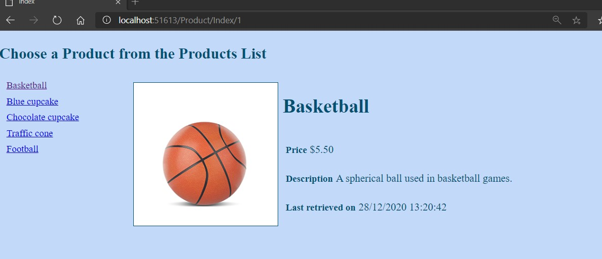
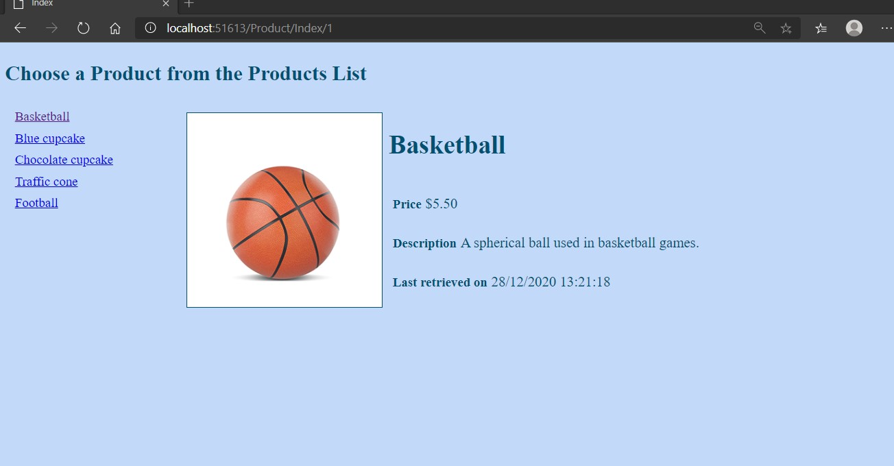

# Tareas del MOC

## Module 12: Performance and Communication

# Lesson 1: Implementing a Caching Strategy 

### Demonstration: How to Configure Caching

- En la clase Product añadimos la propiedad LoadedFromDatabase

- En la clase **ProductRepository** modificamos el codigo  para actualizar la propiedad anterior

- Modificamos **SelectedProduct.cshtml** para incluir la hora de carga

- EJecutamos

  

Comprobamos que la hora cambia

Cambiamos el index.cshtml y le añadimos el cacheo

Comprobamos que no cambian las horas pese a que cambiemos de pantalla

